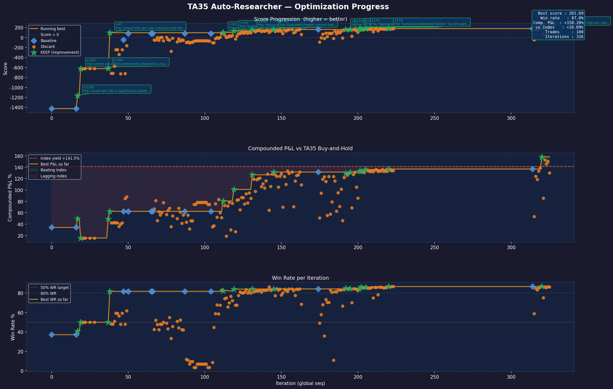

# TA35 Algo Research

Autonomous LLM-driven optimization of a TA35 index trading algorithm, inspired by [Karpathy's autoresearch](https://github.com/karpathy/autoresearch).

The system iteratively improves a signal-scoring engine for the Tel Aviv 35 (TA35) index by feeding hourly historical bar results through a research loop powered by **Gemma 4** (via Google AI Studio free tier). The LLM sees only aggregated KPIs — never raw market data — and proposes code changes each iteration, which are accepted or rejected based on a scoring function.

---

## Results (after ~170 iterations)

| KPI | Baseline | Best achieved |
|---|---|---|
| Win rate | 37.2% | **86.7%** |
| Compounded P&L | +34.4% | **+136.9%** |
| vs TA35 buy-and-hold (+141.5%) | −107% | **−4.7%** |
| Total trades | 43 | 88 |
| Score | −1425 | **+178.9** |


*Score progression, compounded P&L vs index yield, and win rate across ~170 iterations.
Green stars = improvements kept. Orange dots = discarded. Red dashed line = TA35 buy-and-hold benchmark.*

---

## Architecture

```
Algo-machine.py       ← signal engine (modified by the researcher each iteration)
algo-simulator.py     ← evaluation harness: loads historical data → feeds bars → KPIs
auto-researcher.py    ← autonomous LLM optimization loop
program.md            ← researcher instructions (objectives, constraints, interface spec)
plot_research.py      ← visualizer: generates research_progress.png from results.tsv
results.tsv           ← iteration history log (auto-generated at runtime)
research-history/     ← per-iteration code snapshots (auto-generated at runtime)
data/                 ← market data CSVs (local only — not in repo, see Data section)
```

### How the loop works

```
┌─────────────────────────────────────────────────────────┐
│  auto-researcher.py                                     │
│                                                         │
│  1. Run algo-simulator.py → capture KPIs only           │
│     (win rate, P&L, vs-index — never raw price data)    │
│                                                         │
│  2. Send to Gemma 4:                                    │
│     program.md + current Algo-machine.py + KPIs +       │
│     full conversation history (compacted when needed)   │
│                                                         │
│  3. Gemma proposes a code change with reasoning         │
│                                                         │
│  4. Validate: syntax check + interface check            │
│                                                         │
│  5. Run simulator with new code → compute score         │
│     score = (compounded_pnl − index_yield)              │
│           + max(0, win_rate − 50%) × 5                  │
│                                                         │
│  6. Keep if score improved, revert if not               │
│                                                         │
│  7. Sleep 3s → repeat                                   │
└─────────────────────────────────────────────────────────┘
```

### Scoring function

```
score = (compounded_pnl − index_yield)     ← alpha: beat buy-and-hold
      + max(0, win_rate − 50%) × 5        ← bonus for win rate above 50%
      = −∞  if total_trades < 1/month     ← floor: must trade actively
```

- **Primary objective**: beat TA35 buy-and-hold (positive alpha)
- **Bonus**: win rate above 50% adds extra points
- **Floor**: must produce at least 1 completed trade per month of the dataset

### Context management

The conversation with Gemma is persistent across iterations (the model remembers what it tried). When the context approaches the 262k token limit, a separate Gemma call summarises the full history into a ~1500-word research journal, and the conversation is restarted with that summary as context.

---

## Prerequisites

| Requirement | Version |
|---|---|
| Python | ≥ 3.10 |
| pandas | ≥ 2.0 |
| numpy | ≥ 1.24 |
| matplotlib | ≥ 3.7 |
| google-genai | ≥ 1.0 |

Install:

```bash
pip install pandas numpy matplotlib google-genai
```

---

## Data

Market data is **not included** in this repository. You need hourly OHLCV CSVs for the simulation period (~2 years). Place them in the following structure:

```
data/
  ta35/
    ta35_1h_2y.csv          # TA35 index — hourly OHLCV
  ndx/
    ndx_1h_2y.csv           # NASDAQ 100 — hourly OHLCV
  usdils/
    usdils_1h_2y.csv        # USD/ILS exchange rate — hourly OHLCV
  calendars/
    israel_holidays.csv     # columns: date, weekday, holiday_name
    us_holidays.csv         # columns: date, weekday, holiday_name
```

### CSV format

All market data files:

```
datetime,Open,High,Low,Close,Volume
2023-05-03 09:50:00+03:00,1773.83,1781.92,1773.70,1781.80,0
...
```

- `datetime` must be timezone-aware (any tz — converted to UTC internally)
- Different instruments may have different minute offsets (:50, :30, :00) — the simulator handles this with `merge_asof`

Calendar files:

```
date,weekday,holiday_name
2024-04-08,Monday,Passover Eve
...
```

### Suggested data sources

- **TA35**: [Investing.com](https://www.investing.com/indices/ta-25-historical-data) or your broker's API
- **NDX**: [Yahoo Finance](https://finance.yahoo.com/quote/%5ENDX/history/) (`^NDX`)
- **USD/ILS**: [Yahoo Finance](https://finance.yahoo.com/quote/USDILS%3DX/history/) (`USDILS=X`)
- **Calendars**: [Israel holidays](https://www.gov.il/en/departments/topics/israel-national-calendar), [US market holidays](https://www.nyse.com/markets/hours-calendars)

---

## Setup

```bash
# 1. Clone
git clone https://github.com/ranlifshitz/ta35-algo-research.git
cd ta35-algo-research

# 2. Install dependencies
pip install pandas numpy matplotlib google-genai

# 3. Get a free Google AI Studio API key
#    https://aistudio.google.com/apikey
export GOOGLE_API_KEY=AIza...

# 4. Place your market data CSVs in data/ (see Data section above)
```

---

## Usage

### Run the simulator (validate current algo)

```bash
python3 algo-simulator.py
```

Outputs a full KPI report and trade log.

### Run the autonomous research loop

```bash
# Default: 50 iterations, Gemma 4 31B
python3 auto-researcher.py

# Custom
python3 auto-researcher.py --iterations 200 --model gemma-4-31b-it
```

Available models (Google AI Studio free tier):
- `gemma-4-31b-it` — Gemma 4 31B (recommended)
- `gemma-3-27b-it` — Gemma 3 27B

### Visualize results

```bash
python3 plot_research.py           # generates research_progress.png + opens window
python3 plot_research.py --no-show # save only
```

The chart shows:
- **Score progression** with color-coded markers (green star = improvement kept)
- **Compounded P&L vs index yield** with shading above/below the benchmark
- **Win rate** across iterations with 50%/80% reference lines
- Annotations on every improvement with the researcher's reasoning

---

## File reference

### `Algo-machine.py`

The signal engine. Contains a single class `TA35AlgoMachine` with one hot path:

```python
result = algo.process_hour(current_time, row, is_holiday_approaching)
```

**Input `row` fields** (pre-computed by the simulator):

| Field | Description |
|---|---|
| `ta35_close/open/high/low` | TA35 OHLC |
| `atr` | 14-period Average True Range |
| `ma50`, `ma150` | Moving averages |
| `gap_up` | (open − prev_close) / prev_close |
| `rsi` | 14-period RSI |
| `macd`, `macd_signal` | MACD line and signal |
| `low_40h`, `low_10h`, `high_40h` | Rolling price extrema |
| `ndx_1d_ret`, `ndx_1h_ret` | NASDAQ 100 returns |
| `usdils_24h_vol`, `usdils_24h_ret` | USD/ILS volatility and return |

**Return dict keys**: `time`, `price`, `signal`, `score`, `flags`, `ATR`
(`SL` and `TP` added when `signal` is `BUY`, `SELL_TP`, or `SELL_SL`)

This file is the **only thing the researcher modifies**. The simulator and researcher are read-only from Gemma's perspective.

### `algo-simulator.py`

Loads CSVs, computes all technical indicators, feeds bars one-by-one to `TA35AlgoMachine.process_hour()`, and prints a KPI report. Also computes the TA35 buy-and-hold benchmark (first open → last close).

### `auto-researcher.py`

The research loop. Key parameters:

| Parameter | Default | Description |
|---|---|---|
| `--iterations` | 50 | Number of research iterations |
| `--model` | `gemma-4-31b-it` | Google AI Studio model |
| `CONTEXT_LIMIT` | 160,000 est. tokens | Triggers conversation compaction |
| `WIN_RATE_TARGET` | 50% | Win rate bonus threshold |

Outputs:
- `results.tsv` — full iteration log
- `research-history/` — code snapshot at each iteration

### `program.md`

Natural language instructions for the researcher LLM. Defines objectives, constraints, available row fields, scoring logic, and output format. Edit this to change research direction.

### `plot_research.py`

Reads `results.tsv` and generates a 3-panel dark-theme chart. Requires matplotlib.

---

## Extending to live trading

The `Algo-machine.py` interface is designed to be data-source agnostic. To switch from historical simulation to live trading:

1. Keep `Algo-machine.py` unchanged
2. Replace `algo-simulator.py` with a live data feeder that:
   - Pulls current OHLCV from your broker/data provider each hour
   - Computes the same indicator fields (`atr`, `ma50`, `rsi`, etc.)
   - Calls `algo.process_hour(current_time, row, is_holiday_approaching)`
   - Acts on the returned signal (`BUY` / `SELL_TP` / `SELL_SL`)

---

## Acknowledgements

- [**karpathy/autoresearch**](https://github.com/karpathy/autoresearch) — the autonomous LLM research loop pattern this project is based on
- [**Google Gemma 4**](https://ai.google.dev/gemma) via [Google AI Studio](https://aistudio.google.com/) — free-tier LLM used as the researcher
- [**google/genai Python SDK**](https://github.com/googleapis/python-genai) — Google AI Studio API client

---

## License

MIT
